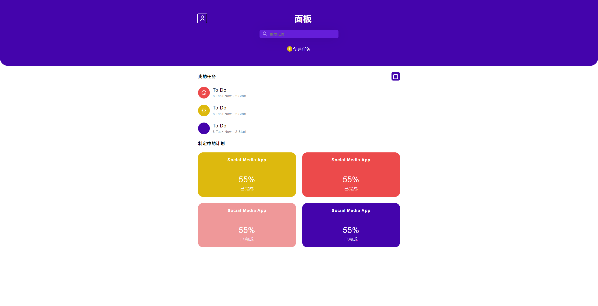
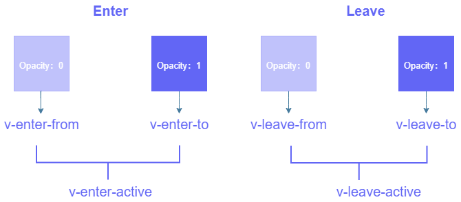
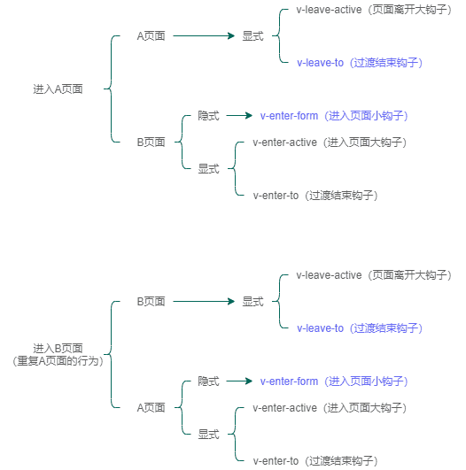

> 这是一个使用`vue`提供`transition`组件的一个简单使用Demo，项目尚未完善，只是做着玩的，有兴趣的朋友可以fork过去自行拓展。

## Vue2 到 Vue3的名称变化
Vue2（官网偷来的）:

vue2相关文档：https://cn.vuejs.org/v2/guide/transitions.html

Vue3（自己画的，意思到位就行，将就看）:

Vue3相关文档：https://v3.cn.vuejs.org/api/built-in-components.html#transition

## HTML
以下是vue-router4.x中无根节点推荐的结构
```html
<template>
  <router-view v-slot="{ Component }">
    <transition>
      <component class="z-child" :is="Component" />
    </transition>
  </router-view>
</template>
```

## CSS
这里主要使用`v-enter-from`，`v-enter-to`两个过渡类。  
先将子页面做绝对定位，为了防止vue-router产生闪跳行为。  
定义过渡类，在这之前先得理解这些类什么时候在什么页面上增删的。  


```css
.v-enter-from {
  opacity: 0; // 组件初始先隐藏
  transform: translateX(50px); // 出现的时候向左滑一下的效果
}
.v-leave-to {
  opacity: 0; // 组件离开的时候要隐藏掉
  transform: translateX(-50px); // 离开的时候向左滑一下
}
```

## 有趣的知识点：
贝塞尔曲线，以下下网站可以实时预览贝塞尔曲线动画  
https://cubic-bezier.com/#.17,.67,.83,.67

## 其他链接：
案例站点：http://todo.zeroojs.com  
调试页面：http://todo.zeroojs.com/example/a